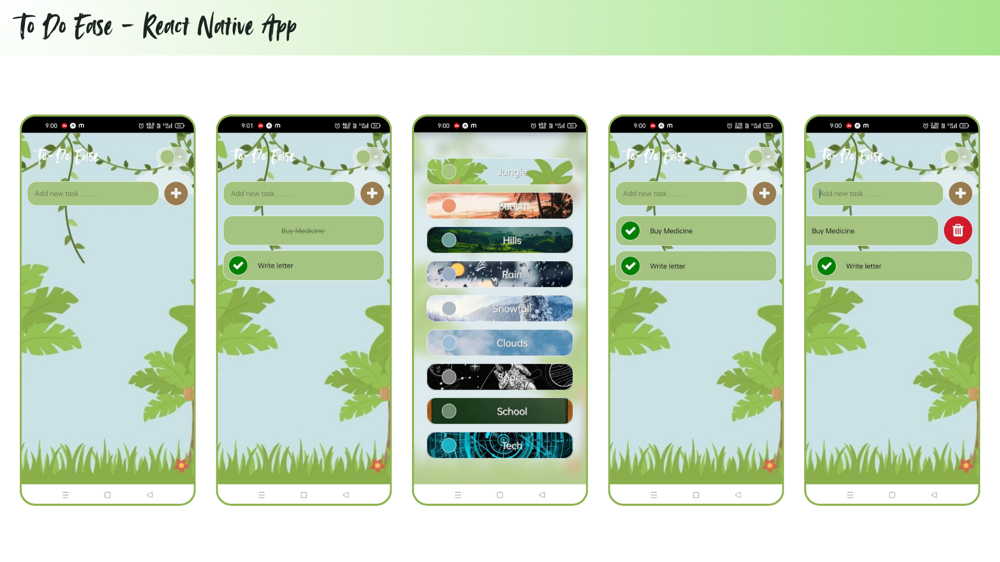

# To-Do Ease
A simple Todo List application built with React Native, featuring multiple themes and basic CRUD operations.

## Features
- **Theme Selection**: Users can choose from a variety of themes, each with its own background image and color scheme.
- **Task Management**: Users can add, delete, and mark tasks as completed.
- **Data Persistence**: Tasks are stored locally using a custom data storage utility.
- **Alerts**: The app displays alerts for empty tasks and duplicate task entries.

## Components
- **Todolistapp**: The main application component that integrates all features.
- **TodoTaskAdder**: Handles task input and addition.
- **Todolist**: Displays and manages the list of tasks.
- **Navigation**: Allows users to change themes.

## Setup
### Local Setup
1. **Clone the Repository**:
   Clone the repository to your local machine.
2. **Install Dependencies**:
   Run `npm install` or `yarn install` to install all dependencies.
3. **Run the Application**:
   - For iOS: Run `npx react-native run-ios`.
   - For Android: Run `npx react-native run-android`.

### GitHub Codespaces Setup
1. **Open in GitHub Codespaces**:
   Click on the "Code" button in your repository and select "Open with Codespaces" to open the project in a cloud-based environment.
2. **Install Dependencies**:
   Run `npm install` or `yarn install` in the terminal within Codespaces.
3. **Start the Development Server**:
   Run `npm start` to start the development server.
4. **Access the App**:
   - **For Android Users**: Install the Expo Go app from the Play Store. Scan the QR code displayed in the Codespaces terminal to open the app on your device.
   - **For iOS Users**: Simply scan the QR code displayed in the Codespaces terminal using your device's camera to open the app.

## Code Structure
- **App.js**: The entry point of the application, rendering the `Todolistapp` component.
- **Todolistapp.js**: Contains the main logic for task management and theme selection.
- **components**: Folder containing reusable components like `TodoTaskAdder`, `Todolist`, and `Navigation`.
- **utils**: Folder with utility functions for data storage.

## Technologies Used
- **React Native**: For building cross-platform mobile applications.
- **JavaScript**: As the primary programming language.
- **Async Storage**: For storing data locally (via a custom wrapper).

## Contributing
Contributions are welcome! Feel free to submit pull requests or report issues.
